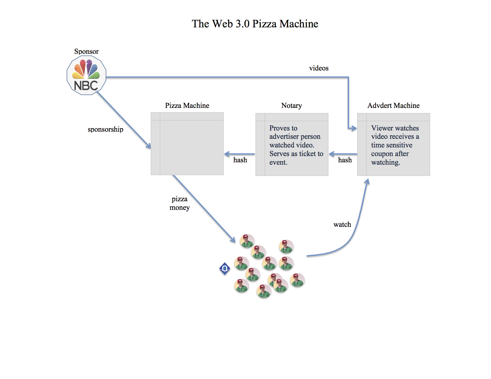

## The Web 3.0 Pizza Machine

The Web 3.0 Pizza Machine allows sponsors of a group to incentivize members of the group to perform some sort of action in return for a reward (such as free pizza). While this demonstration project is greatly simplified, it can also be seen as a proof of concent for a much larger idea: a redefinition of what it means to advertise in the age of the blockchain.

Currently, advertisers "throw" their messages out into the world hoping that the message is reaching receptive ears. Measurement of the results of the advertising is, at best, a guestimate. What if an advertiser could be confident that their adverts were put in front of a known number of real people's eyes. Another problem with advertising today is the issue of online fraud. It is simple to write a bot to visit the online advert and trick the counter into thinking a person saw the impression.

This collection of smart contracts demonstrates how a sponsor can donate money to support a group in return for the group agreeing to consume a pre-defined message provided by the sponsor. Group dynamics comes into play to incentivize the group's primary to encourage his members to accomodate the sponsor. As more and more members participate, the incentive for each individual member to encourage remaining members increases, until, hopefully, the entire group can be encouraged to participate.

