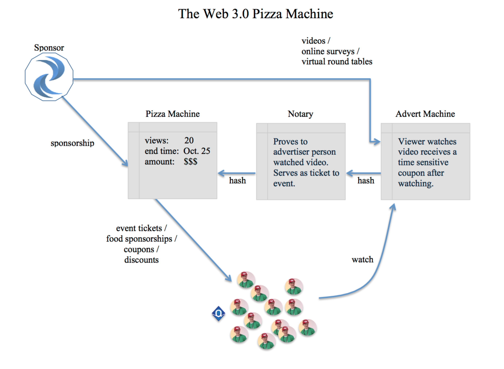

## The Web 3.0 Pizza Machine

The Web 3.0 Pizza Machine allows sponsors to incentivize members of a group to perform some task in return for a reward (such as free pizza). While this demonstration project is purposefully simplified, it may be seen as a proof of concept for a much larger idea: a redefinition of what it means to advertise in the age of the blockchain.

Currently, advertisers "throw" their messages out into the world hoping the message reaches a receptive audience. Measurement of the result is fraught with problems, including--at least on the web--outright fraud. What if an advertiser could be confident that their advertisments were provably put in front of a real human eyes. Currently, advertisers must concern themselves with fraud. It is simple to write a 'bot' to visit an online advertisment.

This collection of smart contracts demonstrates how a sponsor might donate money in support of a group in return for the group agreeing to consume a pre-defined advertising message. Individual and group dynamics are used to incentivize the group's 'host' to encourage his/her members to accomodate the sponsor. As more and more members participate, the incentive for each individual incents them to encourage remaining members to participate, until--hopefully--the entire group consumes the message.

The design of the system is intentially sparse so as to promote clarity of the idea. Of course, it can be extended in many ways including allow a richer set of message types. For example, there is no reason to limit the idea to advertisements. A sponsor may wish for the group members to particpate in an online poll or participate in a virtual focus group. Obviously, there is no need to limit the 'reward' to pizza. It could include beer, for example.

The Philadelphia Ethereum Blockchain Meetup group developed this collection of smart contracts during the later part of 2016 and early into 2017. Any and all comments, criticisms, extensions, or collaboration is welcome.
